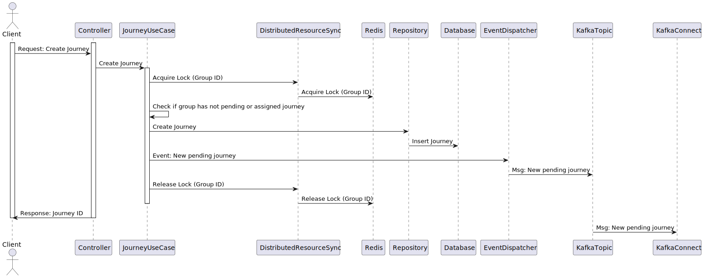
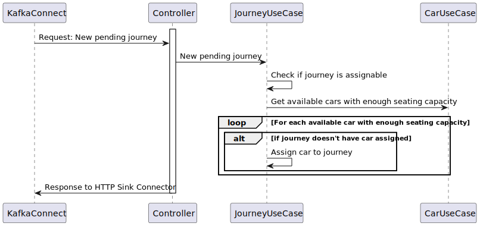
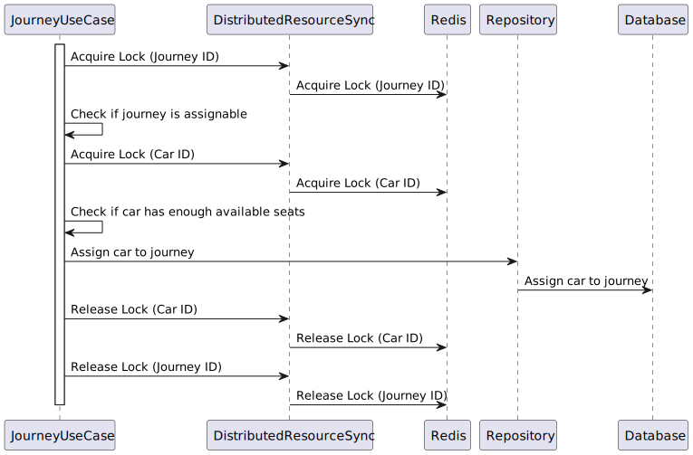

# Introduction

The Car Pooling service implements a very simple API that can be used to track the assignment of cars to journeys according to the seat capacity of the cars and the number of people that will travel in each journey.

People request journeys in groups of 1 to 6. People in the same group want to ride on the same car. You can take any group at any car that has enough empty seats for them, no matter their current location. If it's not possible to accommodate them, they're willing to wait until there is a car available for them. Once a car is available for a group that is waiting, they should ride.

Once they get a car assigned, they will journey until the drop off, you cannot ask them to take another car (i.e. you cannot swap them to another car to make space for another group).

In terms of fairness of trip order: groups should be served as fast as possible, but the arrival order should be kept when possible. If group B arrives later than group A, it can only be served before group A if no car can serve group A.

For example: a group of 6 is waiting for a car and there are 4 empty seats at a car for 6; if a group of 2 requests a car you may take them in the car. This may mean that the group of 6 waits a long time, possibly until they become frustrated and leave.

---
# How to start

To run the application locally, run the following commands: 

1) Clone the repository:
    ```bash
    git clone https://github.com/NicolasBachs/cabify-challenge.git
    ```
2) Go to the repository folder:

    ```bash
    cd cabify-challenge
    ```

3) Configure local environment:
    ```bash
    make env # set environment variables necessary to run the app
    ```

4) Then, run the application:
    ```bash
    make run # run the app and their services using docker-compose
    ```

5) If you want to see the API documentation you can, once the app is up, go to http://localhost:8080/swagger/index.html in your browser.

5) If you want to run acceptance tests:
    ```bash
    make test # run acceptance tests
    ```

# Diagrams
## Architecture components:


## Journey creation diagrams (for a better understanding):

1) The client requests a new journey:

    

2) Once created, in the background, try to assign new pending journey to any available car with enough seating capacity:

    

3) Once a car with the required specifications is found, try to assign the car to the journey:

    

---


# Challenge

## Mission

Take over the design/implementation of a system to manage car pooling.

At Cabify we provide the service of taking people from point A to point B. So far we have done it without sharing cars with multiple groups of people. This is an opportunity to optimize the use of resources by introducing car pooling.

The job was assigned to a team and they have implemented what could be the first prototype. However, we are not very satisfied with their result. The code seems not to reach the quality standards we expect from our engineers. And as soon as the QA team has enabled their acceptance tests suite, the solution shows that it doesn't even work according to the specs.

Now it is your turn to take the baton, assuming the ownership of this prototype. We trust in your skills to edict the situation, fixing all the flaws you might find in the code to deliver something that will surely exceed the expectations of QA with a product that will make us feel really proud.

## Car Pooling Service

The Car Pooling service is aimed to track the availability of our pool of cars.

Cars have a different amount of seats available, they can accommodate groups of up to 4, 5 or 6 people.

Users request cars in groups of 1 to 6. People in the same group want to ride on the same car. You can take any group at any car that has enough empty seats for them. If it's not possible to accommodate them, they're willing to wait until there's a car available for them. Once a car is available for a group that is waiting, they should ride. 

Once they get a car assigned, they will journey until the drop off, you cannot ask them to take another car (i.e. you cannot swap them to another car to make space for another group).

In terms of fairness of trip order: groups should be served as fast as possible, but the arrival order should be kept when possible. If group B arrives later than group A, it can only be served before group A if no car can serve group A.

For example: a group of 6 is waiting for a car and there are 4 empty seats at a car for 6; if a group of 2 requests a car you may take them in the car. This may mean that the group of 6 waits a long time, possibly until they become frustrated and leave.

## Evaluation rules

### Goals

Your goal is to apply the necessary changes to this repository to redirect the situation of the project according to your own quality standards in software development. We expect you to submit a code that will serve as example for other engineers of how we should make software here in Cabify.

Anything you think that should had been done in a different way can be changed. If you are not satisfied with the performance, the design, the code style, the documentation, the build chain, the testing strategy, the Git policy, or any other thing, you can work on improving any of them. 

Please note our expectations are put on improving the quality of the product. We do not expect you to extend its functionality by including additional features. This is not the goal of the challenge, and any modification towards improving the product will not be taken in consideration.

This `INSTRUCTIONS.md` file is the only one that is not part of the deliverable. Feel free to remove it if you want. We do not expect you to make any change to it, and we will completely ignore it.

### Checks

As you will find in later, the codebase is configured to use GitLab for Continous Integration. You will find a CI job called `acceptance` in its config. It executes the tests that QA has delivered so far for the acceptance of this service. As said above, initially the tests do not pass. You must ensure the CI job is not removed and its tests are green before shipping your changes. 

Once you have completed all the changes to the repository and you submit your solution, a team of experienced developers will check the results. They will likely run some further tests to prove the solution works as expected. 

## Tips and tricks

- Use your time wisely. Do not make any change that is not moving the ball one step closer to your archetype of well-done software. 

- Assume it is for real. This code will be eventually used in Production, and different stakeholders will have to deal with it. Think that high-quality software is the one that makes our lives easier. Everybody lives.

- Avoid high latencies in feedback loops. If you find yourself waiting to tests running in GitLab CI for long periods just to figure out if your latest changes are okay... keep calm and rethink the situation. Surely you will find a way to execute those tests in your computer...

## Feedback

In Cabify, we really appreciate your interest and your time. We are highly interested on improving our Challenge and the way we evaluate our candidates. Hence, we would like to beg five more minutes of your time to fill the following survey:

- https://forms.gle/oHdQ3xs2eVMMJy6Q9

Your participation is really important. Thanks for your contribution!

---

# Endpoints

The interface provided by the service is a RESTfull API. The operations are as follows.

## GET /status

Indicate the service has started up correctly and is ready to accept requests.

Responses:

* **200 OK** When the service is ready to receive requests.

## PUT /cars

Load the list of available cars in the service and remove all previous data (existing journeys and cars). This method may be called more than once during the life cycle of the service.

**Body** _required_ The list of cars to load.

**Content Type** `application/json`

Sample:

```json
[
  {
    "id": 1,
    "seats": 4
  },
  {
    "id": 2,
    "seats": 6
  }
]
```

Responses:

* **200 OK** When the list is registered correctly.
* **400 Bad Request** When there is a failure in the request format, expected headers, or the payload can't be unmarshalled.

## POST /journey

A group of people requests to perform a journey.

**Body** _required_ The group of people that wants to perform the journey

**Content Type** `application/json`

Sample:

```json
{
  "id": 1,
  "people": 4
}
```

Responses:

* **200 OK** or **202 Accepted** When the group is registered correctly
* **400 Bad Request** When there is a failure in the request format or the payload can't be unmarshalled.

## POST /dropoff

A group of people requests to be dropped off. Whether they traveled or not.

**Body** _required_ A form with the group ID, such that `ID=X`

**Content Type** `application/x-www-form-urlencoded`

Responses:

* **200 OK** or **204 No Content** When the group is unregistered correctly.
* **404 Not Found** When the group is not to be found.
* **400 Bad Request** When there is a failure in the request format or the payload can't be unmarshalled.

## POST /locate

Given a group ID such that `ID=X`, return the car the group is traveling
with, or no car if they are still waiting to be served.

**Body** _required_ A url encoded form with the group ID such that `ID=X`

**Content Type** `application/x-www-form-urlencoded`

**Accept** `application/json`

Responses:

* **200 OK** With the car as the payload when the group is assigned to a car.
* **204 No Content** When the group is waiting to be assigned to a car.
* **404 Not Found** When the group is not to be found.
* **400 Bad Request** When there is a failure in the request format or the payload can't be unmarshalled.